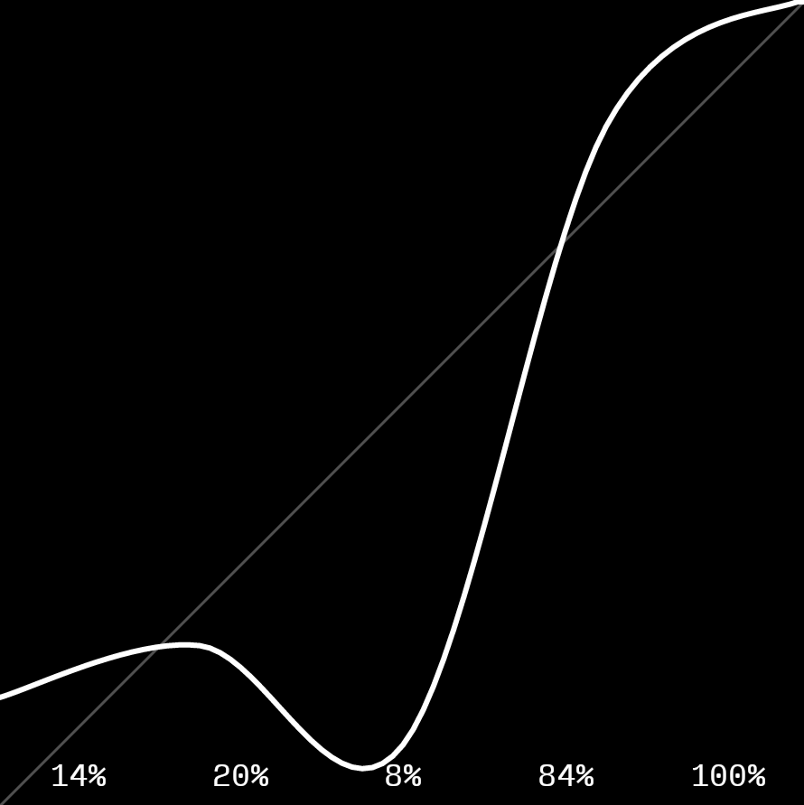
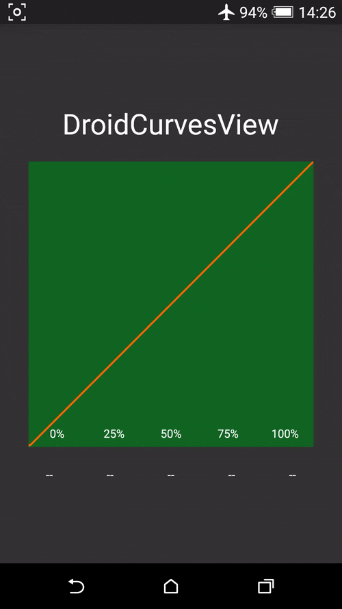

# DroidCurvesView



A custom view for Android inspired by Curves Tool in Photoshop.

一个自定义View，灵感来自Photoshop中的曲线调整工具。

### Preview 预览



Watch on YouTube / 在YouTube上观看: https://youtu.be/rDlI6QYFNdo

### Add to your project 添加到你的项目中

Add JitPack repository to build.gradle in project root.

在项目根目录下的build.gradle中加入以下内容
```
allprojects {
	repositories {
		...
		maven { url "https://jitpack.io" }
	}
}
```

Add the dependency to build.gradle in app root.

在应用目录下的build.gradle中加入以下依赖
```
dependencies {
	compile 'com.github.sumimakito:DroidCurvesView:1.0.0'
}
```

### Quick start 快速上手

CurvesView is as simple as the views you have used before.

Just simply add it to the layout file and define the styles as you like.

CurvesView就如同你之前所用过的View一样简单，你只需要把它加入到布局文件中并随心定义一下样式就好了。

```xml
<com.github.sumimakito.droidcurves.CurvesView
        android:id="@+id/curvesView"
        android:layout_width="300dp"
        android:layout_height="300dp"
        cv:cv_backgroundColor="#116622"
        cv:cv_ctrlPointCount="quintuple"
        cv:cv_curveColor="#ff6600"
        cv:cv_curveWeight="2dp"
        cv:cv_drawText="true"
        cv:cv_drawTouchEffect="true"
        cv:cv_hintLineColor="#50ffffff"
        cv:cv_hintLineWeight="1dp"
        cv:cv_textColor="#ffffff"
        cv:cv_textSize="12sp"
        cv:cv_textTypeface="normal"
        cv:cv_touchEffectColor="#3066ccff"/>
```

A sample module is contained in this repository, you can clone and try out on your Android devices.

一个简单的演示已包含在项目中，你可以Clone后在自己的手机上运行试用。

### Attributes list 属性列表

| Attr. name            |                Explain                                              |    Default    |
|-----------------------|-------------------------------------------------------------------|------------|
| cv_curveColor 		| The color of the curve / 曲线的颜色							          | White |
| cv_backgroundColor 	| The color of the background / 背景的颜色   					          | Black |
| cv_textColor 			| The color of the text label / 文字标签中字体的颜色 			          | White |
| cv_hintLineColor 		| The color of fixed hint line / 固定标记线的颜色			          | White(α=50) |
| cv_touchEffectColor 	| The color of touched area / 区域触摸反馈的颜色			          | White(α=30) |
| cv_textSize 			| The size of the text label / 文字标签中字体大小 				          | 11sp	 |
| cv_curveWeight 		| The weight of the curve / 曲线粗细 							          | 3dp  |
| cv_hintLineWeight 	| The weight of fixed hint line / 固定标记线的颜色 			          | 1dp  |
| cv_drawText 			| Draw text label if set to true / 设为True时显示文字标签 		          | true    |
| cv_drawTouchEffect 	| Draw touch effect if set to true / 设为True时显示触摸反馈              | true    |
| cv_ctrlPointCount 	| The number of control knots / 控制点个数 (enum:triple=3,quintuple=5) | quintuple  |
| cv_textTypeface 	    | The typeface of the text label / 文字标签的字体 (enum:monospace,normal,bold) | normal  |

### It can also... 它还可以...

Automatically process user's touch event with the view and get the new value of the changed control knot.

自动处理用户与View的交互事件并取得发生变化的控制点的最新值

```java
curvesView.setCurvesChangedListener(new CurvesView.CurvesChangedListener() {
            @Override
            public void onCallback(int controlKnotID, float newValue) {
                // newValue is in range float[0,1]
                Log.d("CurvesView", "Control Knot ("+controlKnotID+") changed to "+newValue);
            }
        });
```

Change the style of CurvesView in Java code.

在Java代码中改变CurvesView的样式


```java
curvesView.setCvBackgroundColor(Color.RED);
curvesView.setCvCurveColor(Color.GREEN);
curvesView.setCvCurveWeight(5f);
...
```

### Donate &amp; Support 捐赠与支持

Makito是一个自由的软件开发者，也是一名在校大学生。

欢迎您去查看我的其他开源项目，同时也欢迎通过打赏支持我一下。感谢

##### 支付宝/AliPay

826257232#qq.com (#请换成@)


##### 微信支付


##### PayPal

sumimakito#hotmail.com (replace # with @)

### Copyright &amp; License 版权信息与授权协议

Copyright &copy; 2014-2016 Sumi Makito &amp; Bitcat Interactive Lab.

Licensed under Apache License 2.0 License.

```
Copyright 2014-2016 Sumi Makito & Bitcat Interactive Lab.

Licensed under the Apache License, Version 2.0 (the "License");
you may not use this file except in compliance with the License.
You may obtain a copy of the License at

    http://www.apache.org/licenses/LICENSE-2.0

Unless required by applicable law or agreed to in writing, software
distributed under the License is distributed on an "AS IS" BASIS,
WITHOUT WARRANTIES OR CONDITIONS OF ANY KIND, either express or implied.
See the License for the specific language governing permissions and
limitations under the License.
```
